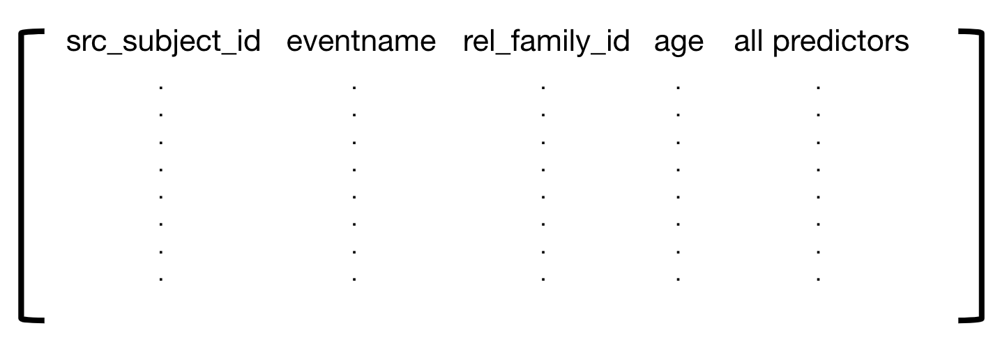
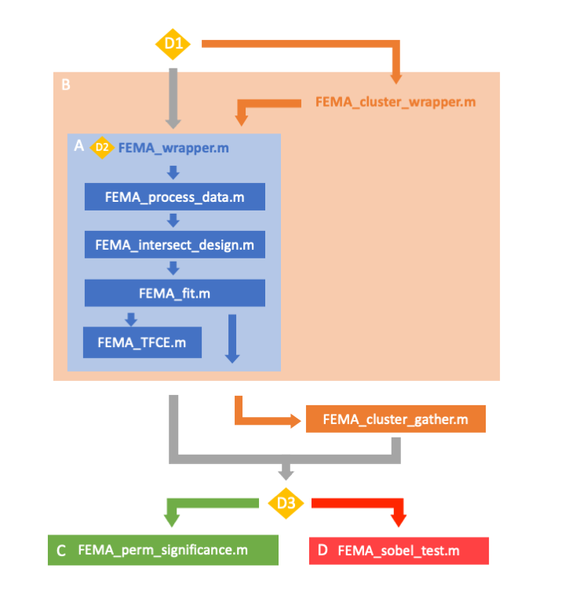

# Fast Efficient Mixed effects Analysis (FEMA)

This package includes code to run mass univariate linear mixed effects analysis in a fast and efficient manner.  This can be done at the whole brain level using vertexwise and voxelwise data, and connectivity matrices.  FEMA includes an external data option (.txt format) which can include columms of imaging or behavioral data.  The code includes an ABCD Study specific wrapper ([`FEMA_wrapper.m`](FEMA/FEMA_wrapper.m)), which uses the concatenated imaging files saved on abcd-sync.  The internal functions within the wrapper can be used to analyse any data as long as its inputs are in the correct format within MATLAB.  The code was developed and tested using MATLAB 2020a.

Technical details on how FEMA works can be found [here](https://doi.org/10.1002/hbm.26579)

**Citation**: Parekh, P., Fan, C. C., Frei, O., Palmer, C. E., Smith, D. M., Makowski, C., Iversen, J. R., Pecheva, D., Holland, D., Loughnan, R., Nedelec, P., Thompson, W. K., Hagler, D. J. Jr, Andreassen, O. A., Jernigan, T. L., Nichols, T. E., & Dale, A. M. (2024). FEMA: Fast and efficient mixed-effects algorithm for large sample whole-brain imaging data. Human Brain Mapping, 45(2), e26579. https://doi.org/10.1002/hbm.26579 

Please see the user guide in docs for more details on how to use FEMA.

* [Installation](#installation)
  + [Data](#data)
  + [Code dependencies](#code-dependencies)
  + [Local setup](#local-setup)
* [Usage](#usage)
  + [Design matrix](#design-matrix)
  + [FEMA](#fema)
  + [Visualization](#visualization)
* [Demos](#demos)
* [Authors](#authors)
* [Copyright](#copyright)
* [Contributing](#contributing)

## Installation
### Data
Whole-brain or surface-based imaging data should already by pre-processed and concatenated across observations in the same atlas space into a 2D matrix in MATLAB that can be input to `FEMA_fit` for analysis (`ymat`).  These data (`ymat`) should be *e.g.* nobservations x nvoxels.

For ABCD Investigators - To run FEMA using the ABCD specific `FEMA_wrapper` we advise that you mirror `abcd-sync` on your own server maintaining the data structure.  You can then provide `FEMA_wrapper` with the appropriate paths to run your analysis.  Abcd-sync is still being developed, so make sure to sync regularly in order to get access to all of the latest imaging data.  Not all imaging modalities are available yet but will be uploaded in the coming weeks.

### Code dependencies
Necessary directories to add to MATLAB path, all part of this repository:
- [`FEMA`](FEMA)
- [`cmig_tools_utils/matlab`](cmig_tools_utils/matlab)
- [`PALM`](PALM), included here for convenience ([source](https://fsl.fmrib.ox.ac.uk/fsl/fslwiki/PALM))

To visualize results:
- for voxel data, use [`showVol`](showVol)
- for vertex data, use [`showSurf`](showSurf)

### Local setup
If you want to run the [`FEMA_wrapper_demo.m`](ABCD_DEMOS/FEMA_wrapper_demo.m), run [`abcdConfig.m`](utils/matlab/abcdConfig.m) to setup your local computer to find the path to the code and data directories (after they have been downloaded).

## Usage
This section details the whole workflow. For FEMA specific instructions, jump [here](#fema).

### Design matrix
FEMA expects the design matrix to be organized as follows:  

The subject ID, eventname, family ID and age columns must be included as the first 4 columns and in that order for use by FEMA to intersect with imaging data and calculate random effects. The columns indicated by 'all predictors' (from column 5 onwards) will be the exact design matrix used by FEMA. This means that if you wish to include age as a predictor in your model you need to make sure it is included in 'all predictors' as well as column4. FEMA will not check whether your design matrix is full rank and **will not add an intercept** to your design matrix if you wish to include one. The design matrix needs to be a **tab separated file** readable by Matlab's "readtable". We have created a function called [`makeDesign.R`](utils/r/makeDesign.R) which creates a tab seperated file with the exact structure expected by FEMA, checks for rank deficiency and automatically adds an intercept. If you wish to use this function (recommended) please see the example script [`makeDesign_demo.R`](ABCD_DEMOS/makeDesign_demo.R). 

### FEMA

[`FEMA_wrapper.m`](FEMA/FEMA_wrapper.m) is a wrapper function designed to simplify analysing data from the ABCD Study. `FEMA_wrapper` saves the output from [`FEMA_fit.m`](FEMA/FEMA_fit.m) into a specified output directory.

FEMA uses three main functions that are called internally within `FEMA_wrapper`:
- `FEMA_process_data`: loads concatenated ABCD imaging data and intersects with imaging info (ABCD specific)
- `FEMA_intersect_design`: intersects imaging data with design matrix
- `FEMA_fit`: algorithm to fit mixed effects model

See [`FEMA_wrapper_demo.m`](ABCD_DEMOS/FEMA_wrapper_demo.m) for full end-to-end demo for running FEMA calculation for voxel-wise and vertex-wise analyses.

Resampling methods (*e.g.* wild bootstrap) can also be run in `FEMA_wrapper` by specifying as an input. These will be used if the user wants to run Threshold Free Cluster Enhancement (TFCE) or the Sobel's test. This can also be specified as an input to `FEMA_wrapper`.

When running many permutations, as they are independent, calls to `FEMA_wrapper` can be submitted as batch jobs on a cluster. See demo in [`FEMA_resampling_demo.m`](ABCD_DEMOS/FEMA_resampling_demo.m), or jump to [this page for more info on tools to run on a cluster](docs/cluster.md).

The below infographic outlines the structure of the FEMA package and how the different functions relate to one another. This flowchart will help you navigate through the FEMA functions and how to conduct mass univariate LME with imaging data using FEMA.

Yellow diamonds mark decision points.  From top to bottom:

- Running on single computer vs cluster
- User specifies inputs to FEMA_wrapper.m depending on specific analysis
- The output from FEMA_wrapper.m can be used as input to different functions that run additional analyses beyond the mass univariate LME

`FEMA_wrapper.m` is designed so that it can be run in parallel on a cluster. In order to run high numbers of permutations, we recommend running several instantiations of `FEMA_wrapper.m` in parallel. The output of these different jobs can then be concatenated into a single file using `FEMA_cluster_gather.m`. Either the output from `FEMA_wrapper.m` or the output from `FEMA_cluster_gather.m` can be input into our additional functions to estimate p-values from permutated distributions or run the Sobel's test for mediation analysis. `FEMA_cluster_wrapper.m` is a helper function to create independent batch jobs to run `FEMA_wrapper.m` on a cluster. Whether this works for you will depend on your cluster set-up. You may need to write your own cluster wrapper script. 

When running several thousand permutations the output files can get very large >20GB.  Therefore, the user can specify variables of interest to FEMA_wrapper.m using the input argument colsinterest and permuted statistics will only be saved for those variables.

### Visualization
- for voxel data, use [`showVol`](showVol) ([docs](showVol/README.md), [demo](ABCD_DEMOS/FEMA_showVol_demo.m))
- for vertex data, use [`showSurf`](showSurf) ([demo](ABCD_DEMOS/FEMA_showSurf_demo.m))

## Demos

### Demo to run `FEMA_wrapper` using [`FEMA_wrapper_demo.m`](ABCD_DEMOS/FEMA_wrapper_demo.m) (for ABCD Investigators)

This is an end-to-end demo that will produce developmental associations (age effects) with different imaging modalities
- For the vertexwise data, this demo will produce age associations with cortical thickness.
- For the voxelwise data, this demo will reproduce the voxelwise restricted normalized isotropic (RNI) age associations published by [Palmer et al. 2022 in Developmental Cognitive Neuroscience](https://www.ncbi.nlm.nih.gov/pmc/articles/PMC8671104/pdf/main.pdf).

To run `FEMA_wrapper_demo.m`
- Open MATLAB (all testing has been done using MATLAB 2020a)
- Run `FEMA_wrapper_demo.m`
- The demo will prompt you to specify inputs in the command window

*Prompt 1: 'Please specify the path to your github directories'*
- Using this directory the demo will add all of the necessary github repos to your MATLAB path
- It assumes all of the repos needed for FEMA have been cloned into the same directory

*Prompt 2: 'Do you want to use abcdConfig to provide the path to abcd-sync?'*
- `abcdConfig` is a function that can be run when first setting up your MATLAB workspace to run FEMA. It ask you to specify the paths to directories used by FEMA. It produces a JSON file that stores these file paths on in your home directory
- You can run the demo without using `abcdConfig` by responding to this prompt with 0 and manually specifying the path to abcd-sync

*Prompt 3: Storing results here: ~/FEMA_demo_results. Would you like to specify a different output directory?'*
- If you response, 0, the FEMA output will be saved in the default directory ~/FEMA_demo_results
- If you respond, 1, the demo will ask you to specify a different output directory to store the FEMA_wrapper results

*Prompt 4: 'Please specify which imaging data to demo'*
- This will produce a prompt for each imaging data type
- Respond with 1 if you want to demo that imaging data type

Annotations in this demo script provide details about the different inputs used for `FEMA_wrapper` This can act as an example script for running `FEMA_wrapper` for different analyses.

### Demo to visualize vertexwise FEMA results on the cortical surface using [`FEMA_showSurf_demo.m`](ABCD_DEMOS/FEMA_showSurf_demo.m)

This is an end-to-end demo designed to visualize the output from `FEMA_wrapper_demo.m`. `FEMA_showSurf_demo.m' plots the results from the vertexwise imaging demo on the cortical surface. This demo produces z statistics of the association between age and cortical thickness from 9-14 years.

To run `FEMA_showSurf_demo.m`
- Open MATLAB (all testing has been done using MATLAB 2020a)
- Run `FEMA_showSurf_demo.m`
- The demo will prompt you to specify inputs in the command window

*Prompt 1: 'Please specify the path to your github directories'*
- Using this directory the demo will add all of the necessary github repos to your MATLAB path
- It assumes all of the repos needed for FEMA have been cloned into the same directory

*Prompt 2: 'Specify directory of where FEMA output saved'*
- If demo has been run on a server with access to abcd-sync, you may need to copy the `FEMA_wrapper_demo.m` output to your local computer to visualize the results

The demo script has been annotated to describe the different options for plotting
- Eg1. colormap can be edited:
 + `fmin`, `fmid`, `fmax` = limits for colorbar
 + `cm` = colormap used
- Eg2. results can be visualized on a convoluted or inflated surface by altering the input arguments to `SurfView_show_new`
 + For convoluted surface: `surf_lh_pial`, `surf_rh_pial`
 + For inflated surface: `surf_lh_inflated`, `surf_rh_inflated`

### Demo to visualize voxelwise FEMA results across the whole-brain using [`FEMA_showVol_demo.m`](ABCD_DEMOS/FEMA_showVol_demo.m)

This is an end-to-end demo designed to visualize the output from `FEMA_wrapper_demo.m`. It plots the results from the voxelwise imaging demo in an interactive viewer that lets you explore across the brain. This demo produces z statistics of the association between age and restricted normalized isotropic diffusion from 9-14 years. The statistics plotted are thresholded using a Bonferonni correction.

Before running this demo, the user will need to download prerendered imaging files to be loaded into showVol prior to visualizing voxelwise results (see the showVol README for more details).

To run `FEMA_showVol_demo.m`
- Open MATLAB (all testing has been done using MATLAB 2020a)
- Run `FEMA_showVol_demo.m`
- The demo will prompt you to specify inputs in the command window

*Prompt 1: 'Please specify the path to your github directories'*
- Using this directory the demo will add all of the necessary github repos to your MATLAB path
- It assumes all of the repos needed for FEMA have been cloned into the same directory

*Prompt 2: 'Specify directory of where FEMA output saved'*
- If demo has been run on a server with access to abcd-sync, you may need to copy the `FEMA_wrapper_demo.m` output to your local computer to visualize the           results

The demo script has been annotated to describe the different options for plotting
-E.g. Options for plotting:
  + `limits` = (1) min (2) max (3) threshold (leave the third value empty to have unthresholded maps)
  + `cols` = which IVs to plot e.g. colnames_model(cols)
  + `showPval` = if true, creates a map of log10 p-values
  + `cmap` = colormap
  + `bg_vol` = background volume to overlay statistics onto – by default uses atlas T1 as background
  + `CSFprob` = if want to mask the CSF can give a probabilistic threshold e.g. if CSFprob=0.8, only voxels in which 80% of participants labelled that voxel as CSF     will be masked
  + `interpMethod’ = interpolation to go from 2mm to 1mm voxels -by default uses linear interpolation; specify 'nearest' to show actual resolution

The demo uses `convertFEMAVols` to process data ready for plotting e.g. overlaying color coded statistics on a background T1.  This is not a necessary step for viewing results in grayscale.  In this case, volume data can be input directly to showVol, e.g. `showVol(vol_stat)` 

Use `showVol` to plot results
 + Inputs to `showVol` are different volumes that will be plotted on different tabs of the showVol GUI
 + The example script plots: T1, T2, FODs, color coded ROI outlines
 + You can also specify exact voxelwise coordinates you would like showVol to open up to (`coords`)
 + The voxelwise mask is saved with the FEMA output so other masked voxelwise data can be converted to volumes for viewing in showVol
      e.g. `vol_beta = fullvol(beta_hat, vol_mask)`

## Citation
Parekh, P., Fan, C. C., Frei, O., Palmer, C. E., Smith, D. M., Makowski, C., Iversen, J. R., Pecheva, D., Holland, D., Loughnan, R., Nedelec, P., Thompson, W. K., Hagler, D. J. Jr, Andreassen, O. A., Jernigan, T. L., Nichols, T. E., & Dale, A. M. (2024). FEMA: Fast and efficient mixed-effects algorithm for large sample whole-brain imaging data. Human Brain Mapping, 45(2), e26579. https://doi.org/10.1002/hbm.26579

## Copyright

This software is Copyright © 2021 The Regents of the University of California. All Rights Reserved. Permission to copy, modify, and distribute this software and its documentation for educational, research and non-profit purposes, without fee, and without a written agreement is hereby granted, provided that the above copyright notice, this paragraph and the following three paragraphs appear in all copies. Permission to make commercial use of this software may be obtained by contacting:

Office of Innovation and Commercialization  
9500 Gilman Drive, Mail Code 0910  
University of California  
La Jolla, CA 92093-0910  
(858) 534-5815  
invent@ucsd.edu

This software program and documentation are copyrighted by The Regents of the University of California. The software program and documentation are supplied “as is”, without any accompanying services from The Regents. The Regents does not warrant that the operation of the program will be uninterrupted or error-free. The end-user understands that the program was developed for research purposes and is advised not to rely exclusively on the program for any reason.

IN NO EVENT SHALL THE UNIVERSITY OF CALIFORNIA BE LIABLE TO ANY PARTY FOR DIRECT, INDIRECT, SPECIAL, INCIDENTAL, OR CONSEQUENTIAL DAMAGES, INCLUDING LOST PROFITS, ARISING OUT OF THE USE OF THIS SOFTWARE AND ITS DOCUMENTATION, EVEN IF THE UNIVERSITY OF CALIFORNIA HAS BEEN ADVISED OF THE POSSIBILITY OF SUCH DAMAGE. THE UNIVERSITY OF CALIFORNIA SPECIFICALLY DISCLAIMS ANY WARRANTIES, INCLUDING, BUT NOT LIMITED TO, THE IMPLIED WARRANTIES OF MERCHANTABILITY AND FITNESS FOR A PARTICULAR PURPOSE. THE SOFTWARE PROVIDED HEREUNDER IS ON AN “AS IS” BASIS, AND THE UNIVERSITY OF CALIFORNIA HAS NO OBLIGATIONS TO PROVIDE MAINTENANCE, SUPPORT, UPDATES, ENHANCEMENTS, OR MODIFICATIONS.

## Contributing
Contributions to this work are welcome, thank you for your time and interest! 
- found a bug? thought of an enhancement? submit a detailed issue for review
- if you want to make changes yourself, you can fork this repo, make changes on your forked version, test the changes, and then submit a pull request
